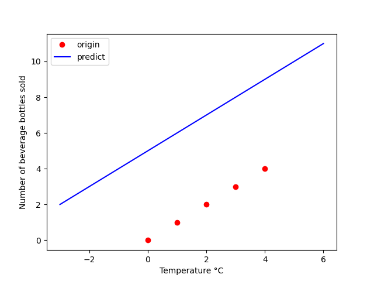
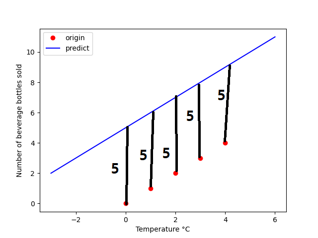
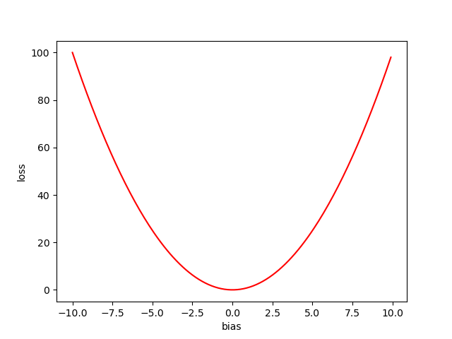
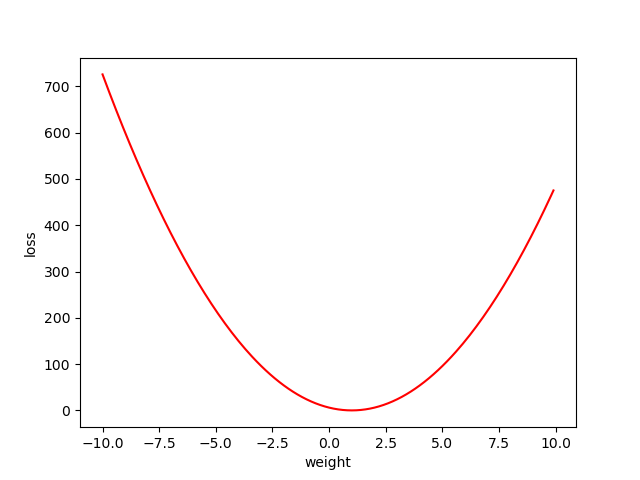
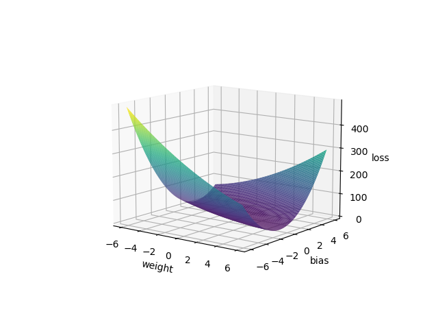

## Gradient Dscent

선행지식 : 일차함수, Numpy 기초   

다음 표와 같이 온도에 따른 음료의 판매량을 기록한 표가 있다.  

  

이런 표를 이용해 온도가 6.5도 10도 1도 일때의 판매량을 예측하고 싶다.  

아마 이런식으로 가상의 선을 그어서 예측할수 있다.  

  

## 이 선을 긋는 방법을 수학적으로 생각해보자.
일단 선은 표에서   
f(x) = ax + b 의 함수로 나타낼 수 있다.   
여기서 a 는 Weight(W)로 b 는 bias(b)로 쓰겠다.   

편하게 계산하기 위해서 만든 판매량의 표이다.  

  
판매량을 쭉 이어주면 예측선이 나오게 된다.

W = 1, b = 0 일때 이런 예측선이 그려진다.  (최적값)  

b를 5로 높여보자 그리고 예측값과 원래값의 거리의 합을 측정해보자  
  

  
절대값(예측값 - 원래값) = 25  

이번엔 b를 -5로 낮춰보자  
  

  
절대값(예측값 - 원래값) = 25  

 
이런식으로 bias를 -10 부터 10까지 해보면   
  
이런 그래프가 나오게 된다.  

그리고 나온 값을 앞으로 Loss라고 하겠다.  

Weight도 마찬가지로 이런 그래프가 나온다.  
  

그리고 W와 b를 동시에 해보면 이런 모양의 그래프가 나온다.  
  

위의 그래프를 보면 그래프가 가장 낮은 지점으로(loss가 가장 낮은 곳) 가면 최적값을 얻을 수 있을 것 같다.   

bias = -5  일때 의 기울기는 음수(-)이다.   
bias = 5 일때는 양수(+)   
bias = 0 일떄는 0 이다 (최적값)

   

즉 0이 되는 쪽으로 bias를 업데이트 해주면 된다.

### bias = -1 * (기울기 * 학습률)

loss = 절대값(예측값 - 원래값)  
의 그래프 모양은 loss가 크든 적든 기울기가 비슷하므로
앞으로는   
### loss = (예측값 - 원래값)^2  
을 이용해 최적값과 멀때는 더 큰 loss를 반환하게 한다. 