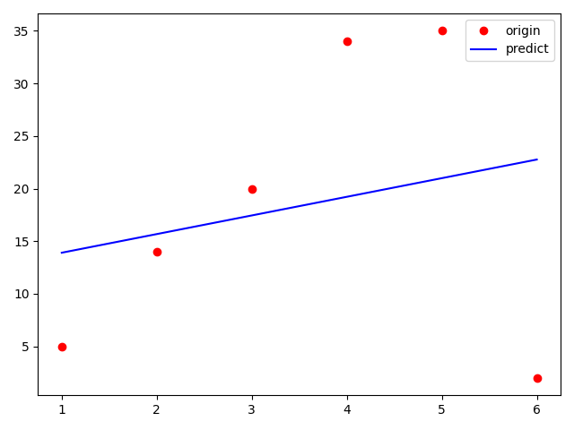

# 선형회귀

## y = Wx+b



## 수치미분으로 구하기

예측하는 parameters  
W, b  
각각 미분해줘야 한다   
-------------------------------------


h 만큼 증가된 hypothesis
```python
hypothesis_w_up = x_train * (W + h) + b
hypothesis_b_up = x_train * W + (b + h)
```

h 만큼 감소된 hypothesis
```python
hypothesis_w_down = x_train * (W - h) + b
hypothesis_b_down = x_train * W + (b - h)
```

up 된 cost 구하기
```python
cost_w_up = np.sum((hypothesis_w_up - y_train) ** 2) / n_data
cost_b_up = np.sum((hypothesis_b_up - y_train) ** 2) / n_data
```

down 된 cost 구하기
```python
cost_w_down = np.sum((hypothesis_w_down - y_train) ** 2) / n_data
cost_b_down = np.sum((hypothesis_b_down - y_train) ** 2) / n_data
```

up과 down 된 cost 로 기울기 구하기
```python
numerical_grad_w = (cost_w_up - cost_w_down) * 2 / h
numerical_grad_b = (cost_b_up - cost_b_down) * 2 / h
```

learning_rate 만큼 학습하기
```python
W -= learning_rate * numerical_grad_w
b -= learning_rate * numerical_grad_b
```

## 편미분으로 구하기

```python
gradient_w = np.sum((W * x_train - y_train + b) * 2 * x_train) / n_data
gradient_b = np.sum((W * x_train - y_train + b) * 2) / n_data
```
